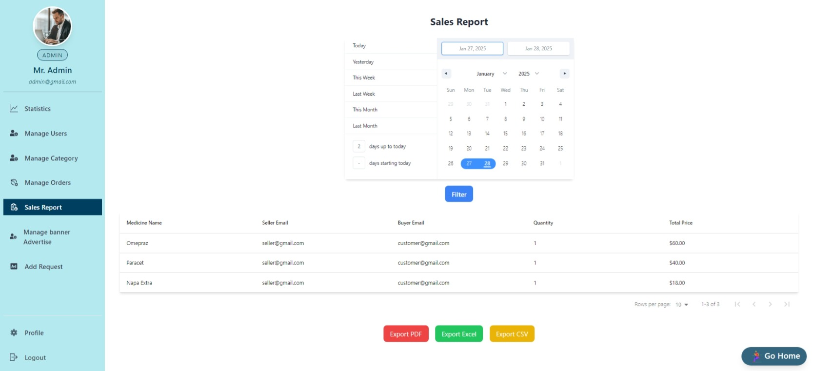

# Project Name: Medicine Hub (Medicine Hub Website).

## Short Description:

This is a single page multi role (Customer, Seller, Admin) web application. This project is an Medicine online shop, designed to connect customer with seller across various categories medicines. It simplifies the process of finding medicine, and buy medicine and admin can manage everything.

## List of React Fundamental concepts used in the project

1. **JSX (JavaScript XML)**
2. **Components**
3. **Props**
4. **State**
5. **Event Handling**
6. **Conditional Rendering**
7. **useEffect Hook**
8. **CReact Router (Routing)**
9. **Conditional Rendering**
10. **Express**
11. **MongoDb**

## List of npm packge

1. **animate.css**
2. **firebase**
3. **moment**
4. **react-countdown**
5. **react-fast-marquee**
6. **react-headroom**
7. **react-responsive-carousel**
8. **react-scroll-to-top**
9. **react-toastify**
10. **swiper**
11. **react-icons**
12. **recharts**
13. **react-helmet**
14. **React Awesome Reveal**
15. **jwt**
16. **axios**
17. **react hook form**
18. **react-data-table-component**
19. **react-date-range**

## Requirement Document

[Requirement Document Link](https://docs.google.com/document/d/1XaaBcRNpA_LjyYqKtb4E-3xTCvU3GOzQFZyXR7HT-Tw/edit?tab=t.0).

**Admin email: admin@gmail.com**

**Admin password: 123456**

**Seller email: seller@gmail.com**

**Seller password: 123456**

## Live Link Firebase deploy

[Medicine Hub Web App](https://medicine-hub-41b7f.web.app/).

### Preview

